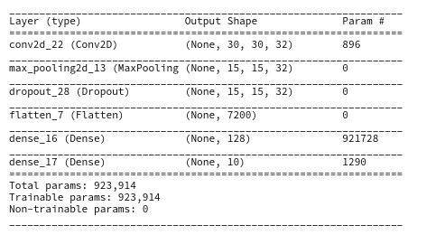
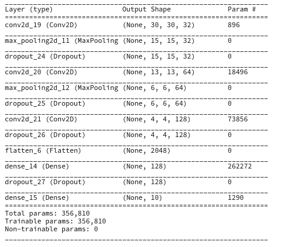
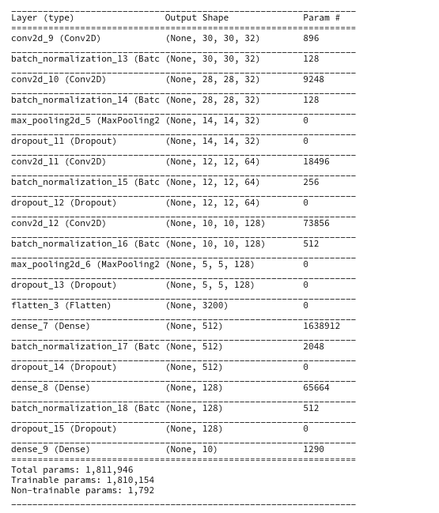

# CIFAR-10 Image classification using CNN's
By Blasko, Oliver

## Introduction
In this project we explored the CIFAR-10(Canadian Institute For Advanced Research) data set. CIFAR-10 is a labeled subset of the 80 million tiny images dataset. The dataset contains 60,000 32x32 color images in 10 different classes. The 10 different classes represent airplanes, cars, birds, cats, deer, dogs, frogs, horses, ships, and trucks. There are 6,000 images of each class.

We built 3 different CNN-based classification models to evaluate performances on this data set. We constructed our models using the Keras framework. For more information on the framework, you can refer to the documentation [here](https://keras.io/). Here is the list of models we tried out and compared their results:

- CNN with 1 Convolutional Layer
- CNN with 3 Convolutional Layer
- CNN with 4 Convolutional Layer

We trained the models on training data( 50000 images ) and evaluated each model on data that the models has never seen before - testing data( 10000 images ). We trained the models for **20 epochs** with batch size of **35 images**.The models were compiled with **categorical_crossentropy loss function** and **Adam optimizer**.

## Importing the CIFAR-10 data set
At first we were working with data set downloaded from the official [site](https://www.cs.toronto.edu/~kriz/cifar.html) of the data set, but after doing some research we found out that this particular data set is already prepared in a form of training and testing sets and ready to load from keras framework itself.

## Data exploratory analysis
As it can be seen in the accompanied notebook we explored our data set thoroughly and we found out that our data needs some preprocessing before we feed it into our networks, specifically:

### Encoding the categorical target variables
We found out that the label images were stored as integer values between 0-9. We transformed them into categorical variables with one hot encode technique using keras bult in function [to_categorical](https://www.tensorflow.org/api_docs/python/tf/keras/utils/to_categorical). 

### Scaling the images
The pixel values of the images fell in the range of 0 to 255. We needed to scale these values to a range of 0 to 1 before feeding it to the neural network model. For this, we divided the values by 255. It's important that the training set and the testing set are preprocessed in the same way.

## Architecture of the models
We used the model architectures that was described in this [article](https://towardsdatascience.com/the-4-convolutional-neural-network-models-that-can-classify-your-fashion-images-9fe7f3e5399d) for solving similar problem as ours with similar data set - Fashion-MNIST - images with 10 different classes of clothes.
We have built 3 different CNN-based classification models to evaluate performances on this data set:
For all three models we used [sequential model](https://keras.io/models/sequential/).
These are the several layers we used in our models( with documentation links and description):
- [CONV2D](https://keras.io/layers/convolutional/#conv2d) - performs convolution
  - filters - number of output channels 
  - kernel_size - an integer or tuple/list of 2 integers, specifying the width and height of the 2D convolution window
  - activation - activation function
  - input_shape - shape of input

- [MaxPooling2D]() - performs 2D max pooling.
- [Dropout](https://keras.io/layers/core/#dropout) - applies dropout.
-  [Flatten](https://keras.io/layers/core/#flatten) - flattens the input, does not affect the batch size.
- [Dense](https://keras.io/layers/core/#dense) layer - regular densely-connected NN layer.
- [Activation](https://keras.io/layers/core/#activation) - applies an activation function.
- [LeakyReLU](https://keras.io/layers/advanced-activations/#leakyrelu) - applies leaky relu activation.
- [Dropout](https://keras.io/layers/core/#dropout) - applies dropout.

### CNN with 1 Convolutional Layers model Architecture

### CNN with 3 Convolutional Layers model Architecture

### CNN with 4 Convolutional Layers model Architecture

## Evaluation of models
After we trained each model we evaluated it on testing data(loss, accuracy) and plotted loss and accuracy curve as well as confusion matrix which can be seen in the notebook.

Here is the evaluation table of our models:

| Model        | Accuracy -- testing data           | Loss -- testing data  | Accuracy -- training data           | Loss -- training data  | Training time |
| ------------- | ------------- | ----- | ----- | ----- | ----- |
| CNN with 1 Convolutional Layer      | 0.650 | 1.398  | 0.884 | 0.321 | 16min 35s |
| CNN with 3 Convolutional Layer     |  0.7381      |  0.768  | 0.729 | 0.769 | 1h 2min 32s 
| CNN with 4 Convolutional Layer |  0.824     | 0.514    | 0.837 | 0.514 | 1h 42min 11s

## Conclusion
We trained and evaluated 3 different CNN-based classification models. As it is shown in the table above we found out that that the best performing model for CIFAR-10 data set is CNN with 4 Convolutional Layer with final accuracy of **0.824** and final loss of **0.514**(testing data). If we look at the table we can observe that with higher number of convolutional layers the model becomes more accurate. We can also observe that in the case of the CNN with 1 Convolutional Layer model there is a huge difference between the accuracy of testing vs training data. It looks like that this model over-fitted the data so it will not be practical to use it. However our last model - CNN with 4 Convolutional Layer is doing pretty good job and with little tweaks and finding the optimal parameters( increasing training epochs, different dropout rates, etc.) could be put into the practical use of classifying images in this data set.
